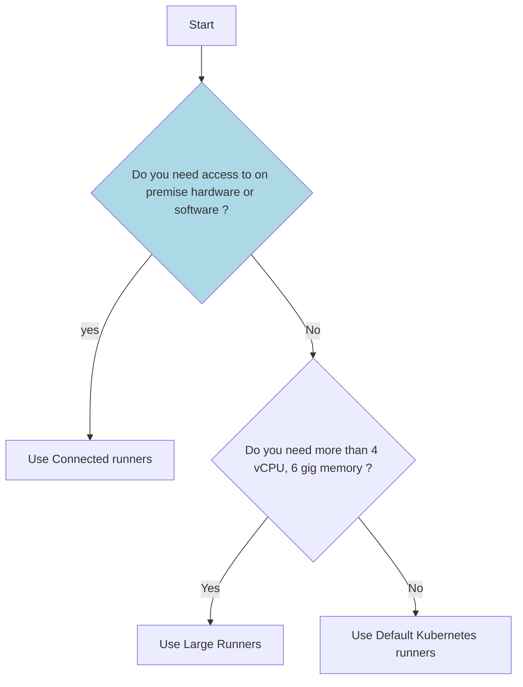

```mermaid
flowchart TD
    A[Start] --> B{Do you need access to on premise hardware or software ?};
    B --> |yes| C[Use Connected runners];
    B -->|No| D{Do you need more than 4 vCPU, 6 gig memory ?};
    D -->|Yes| E[Use Large Runners];
    D --> |No| F[Use Default Kubernetes runners];
    click B "http://www.github.com"
    class B Blue;
    classDef Blue fill:lightblue;
```
